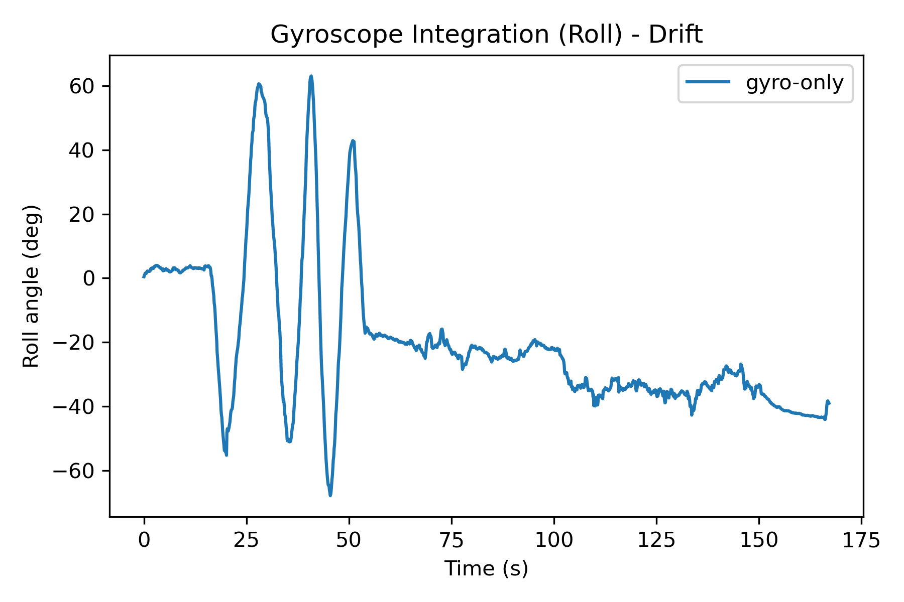
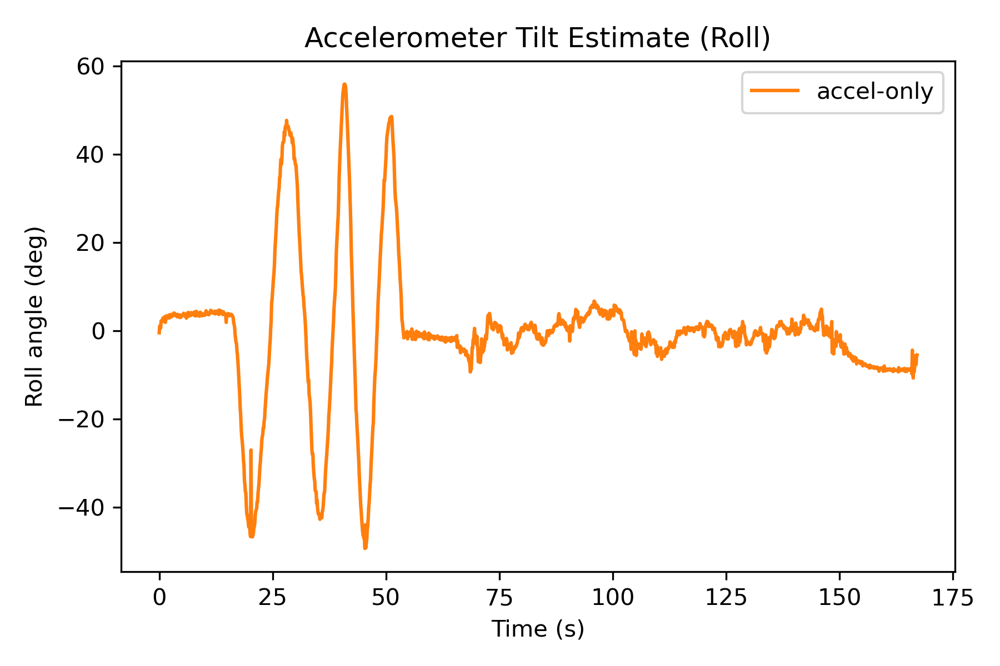
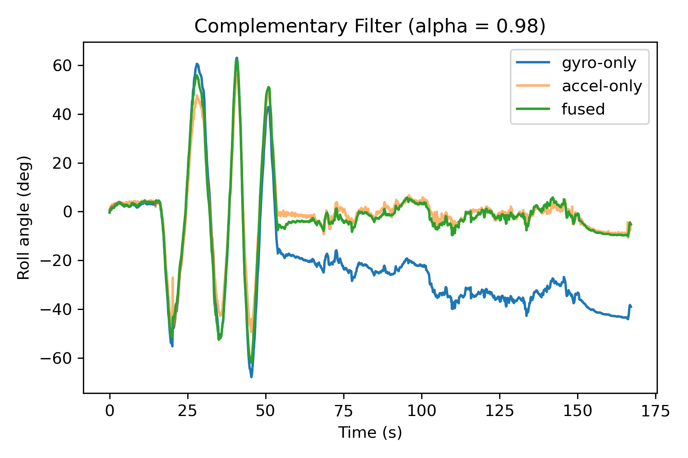

# IMU Orientation Estimator

This project estimates roll orientation from IMU data by combining
gyroscope integration and accelerometer tilt using a complementary filter.

## Motivation
- Gyroscopes provide smooth angular motion but drift over time
- Accelerometers provide absolute orientation but are noisy during motion
- A complementary filter balances these trade-offs

## Method
- Roll angle computed from accelerometer gravity vector
- Angular velocity integrated from gyroscope data
- Complementary filter fuses both estimates

## Results
### Gyroscope Integration (Drift)



### Accelerometer Tilt Estimate


### Complementary Filter Roll Estimate



The fused signal tracks fast motion from the gyroscope while correcting
long-term drift using accelerometer measurements.

## How to Run
```bash
pip install -r requirements.txt
python src/complementary_filter.py
